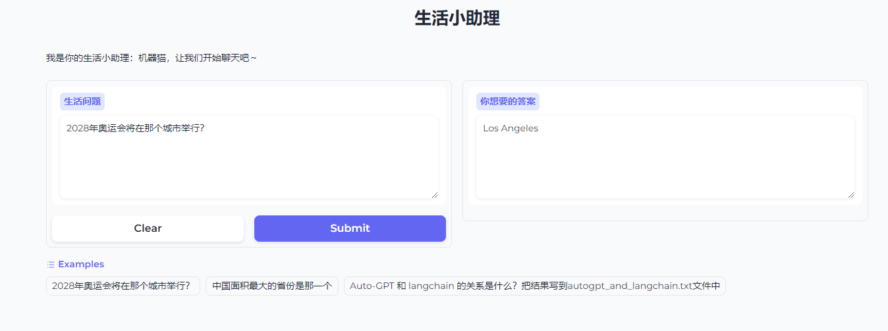

### 基于LangChain实现网红项目 AutoGPT
- 项目启动步骤：
```window10
cd .\OPENAI-QUICKTART\autogpt_graphic_interface
$env:OPENAI_API_KEY='openai apikey'
$env:SERPAPI_API_KEY='google search apikey'
python .\autogpt_graphic_interface.py
```

- 查询结果展示


